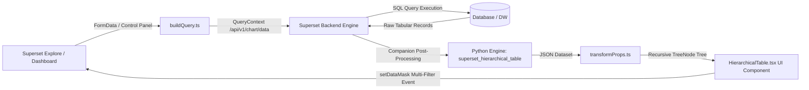

# StratumTree — Hierarchical Matrix Grid & Tree Table for Apache Superset 6.1.0

[](https://superset.apache.org/)
[](LICENSE)
[](https://francescocastaldi.github.io/superset-plugin-chart-hierarchical-table/)
[](https://www.typescriptlang.org/)
[](https://react.dev/)
[](https://ant.design/)
[](https://www.python.org/)

**StratumTree** is an enterprise-grade visualization plugin and companion aggregation engine designed for **Apache Superset 6.1.0+**. It delivers an interactive **Hierarchical Tree Table and Matrix Grid** with dual-mode hierarchy processing (multi-dimensional level grouping and recursive parent-child graph traversal), automated roll-up calculations, native Superset dashboard cross-filtering (`setDataMask`), and automated cross-platform installation tooling.

---

# StratumTree — Hierarchical Matrix Grid & Tree Table for Apache Superset 6.1.0

[](https://superset.apache.org/)
[](LICENSE)
[](https://francescocastaldi.github.io/superset-plugin-chart-hierarchical-table/)
[](https://www.typescriptlang.org/)
[](https://react.dev/)
[](https://ant.design/)
[](https://www.python.org/)

**StratumTree** is an enterprise-grade visualization plugin and companion aggregation engine designed for **Apache Superset 6.1.0+**. It delivers an interactive **Hierarchical Tree Table and Matrix Grid** with dual-mode hierarchy processing (multi-dimensional level grouping and recursive parent-child graph traversal), automated roll-up calculations, native Superset dashboard cross-filtering (`setDataMask`), and automated cross-platform installation tooling.

---

## 📑 Table of Contents

- [Visual Preview & Interactive Animation](#-visual-preview--interactive-animation)
- [Live Dashboard Simulator on GitHub Pages](#-live-dashboard-simulator-on-github-pages)
- [Architecture & Key Features](#-architecture--key-features)
- [Repository Structure (Monorepo Layout)](#-repository-structure-monorepo-layout)
- [Installation Guide](#-installation-guide)
  - [Automated Installation (Docker Compose)](#1-automated-installation-recommended)
  - [Manual Installation](#2-manual-installation)
- [Explore Parameters (Control Panel)](#-explore-parameters-control-panel)
- [Verification & Test Suite](#-verification--test-suite)
- [Maintainer & Governance](#-maintainer--governance)
- [License](#-license)

---

## 📸 Visual Preview & Interactive Animation

### 🎬 Dynamic Cross-Filtering Animation & Multi-Chart Interactivity

The vector animation illustrates tree navigation, branch expansion, the emitted `setDataMask` cross-filter event, and the reactive update of companion dashboard charts:


### 🖼️ UI Screenshot in Apache Superset 6.1.0


---

## 🌐 Live Dashboard Simulator on GitHub Pages

A complete, interactive simulation of an Apache Superset 6.1.0 dashboard with 4 real-time linked companion charts is available:

👉 **[Access the Live Simulator on GitHub Pages](https://francescocastaldi.github.io/superset-plugin-chart-hierarchical-table/)**

- **Main Hierarchical Table**: Node expand/collapse, in-tree path-preserving search, interactive multi-selection via checkboxes and row click (`.selected-filter-row`).
- **Big Number KPI Card with Sparkline**: Instant recalculation of filtered totals on atomic records and corresponding count of matched records/entities.
- **Donut Share Composition Chart**: Dynamic proportional distribution of metric share across selected entities.
- **Distribution Bar Chart**: Visual comparison across selected branches with checkmark indicators `✓` and highlighted bars.
- **Quarterly Performance Area Chart**: Temporal trend (Q1–Q4) recalculated in real-time over the filtered subset.
- **Active Filter Chips & Broadcast Banner**: Active filter management with selective badge removal `✕` and `Clear All` action.
- **Superset Event Console**: Live inspection of the payload emitted by `setDataMask` grouped by column with `IN` operators.

---

## 🏛️ Architecture & Key Features



### 1. Dual-Mode Hierarchy Processing

- **Multi-Dimension Level Grouping**: Grouping by an ordered sequence of dimensions (e.g., `Region > Country > City > Store`).
- **Parent-Child Adjacency Graph**: Recursive adjacency graph traversal (e.g., Organizational charts `employee_id -> manager_id`, Chart of Accounts `account_code -> parent_account_code`).

### 2. Native Superset 6.1.0 Multi-Selection Cross-Filtering (`setDataMask`)

- **Multi-Selection & Union Evaluation**: Simultaneous selection of multiple nodes across different hierarchy depths with atomic record evaluation (zero double counting).
- **Subtree Graph Traversal**: For Parent-Child hierarchies, automatic recursive discovery of all descendant IDs for each selected node.
- **Grouped `IN` Filters**: Automatic generation of column-aggregated filter arrays (`{ col: "country", op: "IN", val: ["USA", "Germany"] }`).
- **Path-Aware Filtering**: Automatic transmission of ancestor hierarchy levels to preserve filter context.
- **URI-Safe Key Handling**: Protection against special characters, whitespace, and quotes in hierarchical paths.
- **Active Filter Management**: Interactive badges with single filter removal `✕`, `Clear All (N)` button, and `.selected-filter-row` visual highlights.

### 3. Automated Roll-up & Subtotals Computation

- Post-order tree traversal algorithm computing subtotals across all non-leaf nodes (Sum, Mean, Min, Max, Count).
- Automatic generation of the overall **Grand Total** summary row.

### 4. Companion Backend Engine (Python)

- `superset_hierarchical_table` package for heavy server-side processing over large Pandas DataFrames and SQL queries with recursive CTEs.

### 5. Responsive Scrollbars & Viewport Containment

- **Dynamic Bounding**: Direct binding to the `width` and `height` properties provided by the Apache Superset dashboard layout engine.
- **Bidirectional Internal Scrolling**: `.table-scroll-wrapper` container with `min-height: 0` and `min-width: 0` Flexbox constraints, ensuring smooth horizontal/vertical scrolling without layout clipping or page overflow.
- **Opaque Sticky Headers & Columns**: Fixed column headers (`th`) and tree hierarchy columns (`td.hierarchy-cell`) with opaque backgrounds and subtle drop shadows to prevent visual overlap.
- **Custom Scrollbar Styling**: Consistent, minimal scrollbars across standard browsers and WebKit rendering engines.

---

## 📂 Repository Structure (Monorepo Layout)

```
superset-plugin-chart-hierarchical-table/
├── .github/
│   └── workflows/
│       ├── ci.yml                             # CI pipeline: TypeScript & Pytest suites
│       └── deploy-pages.yml                   # CD pipeline: automated GitHub Pages deployment
│
├── configs/
│   └── tsconfig.base.json                     # Shared base TypeScript configuration
│
├── packages/
│   ├── superset-plugin-chart-hierarchical-table/  # Frontend Plugin (React 18 / TypeScript)
│   │   ├── package.json
│   │   ├── tsconfig.json
│   │   ├── src/
│   │   │   ├── index.ts                       # Entry point and plugin registration
│   │   │   ├── plugin/                        # buildQuery, controlPanel, transformProps
│   │   │   ├── components/                    # HierarchicalTable UI, Ant Design v5 styles
│   │   │   ├── types/                         # TypeScript interfaces and type definitions
│   │   │   └── utils/                         # treeBuilder, aggregations, formatters
│   │   └── test/                              # Jest unit tests
│   │
│   └── superset-hierarchical-table-backend/       # Companion Backend Engine (Python)
│       ├── pyproject.toml                     # PEP 621 configuration and dependencies
│       ├── superset_hierarchical_table/
│       │   ├── processors/                    # tree_aggregator, parent_child
│       │   └── queries/                       # sql_builder and recursive CTEs
│       └── tests/                             # Pytest test suite
│
├── site/                                      # Interactive documentation & Dashboard Simulator
│   ├── index.html                             # Superset 6.1.0 dashboard simulator UI
│   ├── styles.css                             # Ultra-minimal dark design system
│   ├── app.js                                 # Client-side engine and chart synchronization
│   ├── favicon.svg                            # Vector SVG favicon
│   ├── favicon.png                            # 32x32 px bitmap favicon
│   ├── favicon.ico                            # ICO format favicon
│   └── .nojekyll                              # Bypass Jekyll processing on GitHub Pages
│
├── scripts/                                   # Automation and injection tooling
│   ├── install.ps1                            # Automated Windows PowerShell installer
│   ├── install.sh                             # Automated Linux / macOS installer
│   ├── installer.py                           # AST/regex injection engine with backup & rollback
│   └── docker-compose.override.example.yml    # Source mount template for Docker Compose
│
├── docs/                                      # Technical specifications and guides
│   ├── architecture.md                        # Detailed data flow and transformation pipeline
│   ├── docker_installation_windows.md         # Step-by-step Windows & Docker Desktop guide
│   ├── installation.md                        # General installation manual
│   ├── hierarchy_guide.md                     # Data modeling (Multi-Dimension vs Parent-Child)
│   ├── control_panel_reference.md             # Complete Explore control reference
│   └── images/                                # Graphical assets and SVG animations
│
├── examples/                                  # Sample verification datasets
│   ├── financial_pnl.csv                      # P&L / Financial statement dataset
│   ├── org_chart.csv                          # Corporate org chart dataset
│   ├── sales_hierarchy.csv                    # Multi-level retail sales hierarchy
│   └── interactive_preview.html               # Standalone local HTML test runner
│
├── Makefile                                   # Task automation (install, build, test, lint)
├── package.json                               # Monorepo root NPM Workspace configuration
├── CHANGELOG.md                               # Keep a Changelog history
├── MAINTAINER.md                              # Operational runbook for maintainers
├── LICENSE                                    # Open Source Apache 2.0 license
└── README.md                                  # Main repository documentation
```

---

## 🚀 Installation Guide

### 1. Automated Installation (Recommended)

When using a local Apache Superset 6.1.0 instance deployed via **Docker Compose**, run the automated installer which performs safety backup, AST code injection, and frontend compilation in a single step.

#### On Windows (Single-Click Batch / PowerShell):

Simply run or double-click `install.bat` in the repository root:
```cmd
install.bat
```
Or execute the automated PowerShell installer directly:
```powershell
.\install-plugin.ps1
# Or targeting a custom path:
.\install-plugin.ps1 -SupersetPath "C:\Users\admmaps\superset_6_1_0\superset"
```

#### On Linux / macOS / Git Bash:

```bash
./scripts/install.sh --superset-path "/path/to/superset"
```

_For detailed instructions on Windows with WSL 2 and Docker Desktop, see the [Windows Docker Installation Guide](docs/docker_installation_windows.md)._

---

### 2. Manual Installation

#### Prerequisites:

- **Node.js**: `>= 20.x` LTS
- **npm**: `>= 10.x`
- **Python**: `>= 3.9`
- **Apache Superset**: `6.1.0+`

#### Step A: Register the Frontend Plugin

Navigate to the `superset-frontend/` directory of your Superset repository:

```bash
cd superset-frontend
npm install superset-plugin-chart-hierarchical-table
```

In `superset-frontend/src/visualizations/presets/MainPreset.js` (or `MainPreset.ts`), register the plugin:

```typescript
import { HierarchicalTableChartPlugin } from 'superset-plugin-chart-hierarchical-table';

new HierarchicalTableChartPlugin().configure({ key: 'hierarchical_table' }).register();
```

#### Step B: Install the Companion Backend (Optional)

```bash
cd packages/superset-hierarchical-table-backend
pip install -e .
```

---

## 🎛️ Explore Parameters (Control Panel)

| Parameter                        | Type         | Description                                                                        |
| -------------------------------- | ------------ | ---------------------------------------------------------------------------------- |
| **Hierarchy Mode**               | Select       | `Multi-Dimension Grouping` or `Parent-Child Adjacency`.                             |
| **Hierarchy Dimensions**         | Multi-Select | Ordered list of dimension columns (from root to leaf level).                       |
| **Node ID Column**               | Select       | Unique node identifier column (visible in Parent-Child mode).                      |
| **Parent ID Column**             | Select       | Parent node identifier column (visible in Parent-Child mode).                      |
| **Metrics**                      | Metrics      | Quantitative numeric metrics to aggregate and display in the matrix.               |
| **Initial Expand Depth**         | Select       | Initial tree expansion depth (`Collapse All`, `Level 1`, `Level 2`, `Expand All`). |
| **Show Subtotals / Rollup**      | Checkbox     | Computes intermediate roll-up subtotals on non-leaf parent nodes.                  |
| **Show Grand Total Row**         | Checkbox     | Displays the overall Grand Total row at the top of the table.                      |
| **Emit Dashboard Cross-Filters** | Checkbox     | Emits `setDataMask` cross-filtering events on row click across the dashboard.      |
| **Enable In-Tree Search**        | Checkbox     | Real-time search bar with branch path preservation and highlight.                  |
| **Sticky Table Header**          | Checkbox     | Locks column headers during vertical scrolling.                                    |
| **Sticky Hierarchy Column**      | Checkbox     | Locks the primary hierarchical column during horizontal scrolling.                 |

_For a comprehensive guide to all form controls, see the [Control Panel Reference](docs/control_panel_reference.md)._

---

## 🧪 Verification & Test Suite

To run the complete automated test suite (TypeScript + Pytest):

```bash
# Run all tests across the monorepo
make test

# Frontend unit tests (Jest)
npm run test

# Backend unit tests (Pytest)
cd packages/superset-hierarchical-table-backend && pytest tests/ -v
```

---

## 👤 Maintainer & Governance

This repository is maintained by **[Francesco Castaldi](https://github.com/FrancescoCastaldi)**.

---

## 📄 License

Released under the terms of the **[Apache License 2.0](LICENSE)**. Compatible with Apache Superset 6.1.0+.

