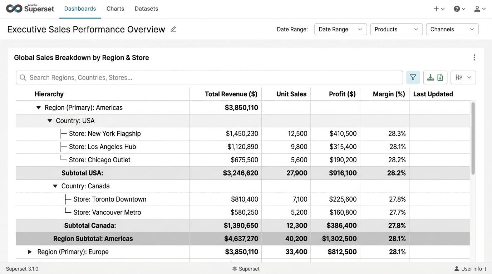
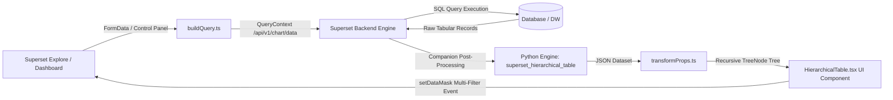

# StratumTree — Hierarchical Matrix Grid & Tree Table for Apache Superset 6.1.0

[](https://superset.apache.org/)
[](LICENSE)
[](https://francescocastaldi.github.io/superset-plugin-chart-hierarchical-table/)
[](https://www.typescriptlang.org/)
[](https://react.dev/)
[](https://ant.design/)
[](https://www.python.org/)

**StratumTree** is an enterprise-grade visualization plugin and companion aggregation engine designed for **Apache Superset 6.1.0+**. It delivers an interactive **Hierarchical Tree Table and Matrix Grid** with dual-mode hierarchy processing (multi-dimensional level grouping and recursive parent-child graph traversal), automated roll-up calculations, native Superset dashboard cross-filtering (`setDataMask`), and automated cross-platform installation tooling.

---

## 📑 Sommario

- [Anteprima Visiva & Animazione Interattiva](#-anteprima-visiva--animazione-interattiva)
- [Simulatore Dashboard Live](#-simulatore-dashboard-live-su-github-pages)
- [Architettura & Funzionalità Chiave](#-architettura--funzionalità-chiave)
- [Struttura del Repository (Monorepo Layout)](#-struttura-del-repository-monorepo-layout)
- [Guida all'Installazione](#-guida-allinstallazione)
  - [Installazione Automatica (Docker Compose)](#1-installazione-automatica-consigliata)
  - [Installazione Manuale](#2-installazione-manuale)
- [Parametri Explore (Control Panel)](#-parametri-explore-control-panel)
- [Collaudo & Test Suite](#-collaudo--test-suite)
- [Maintainer & Governance](#-maintainer--governance)
- [Licenza](#-licenza)

---

## 📸 Anteprima Visiva & Animazione Interattiva

### 🎬 Animazione Dinamica del Cross-Filtering & Interattività Multi-Grafico

L'animazione vettoriale illustra l'interazione ad albero, l'espansione dei rami dimensionali, l'emissione dell'evento `setDataMask` e la reattività dei grafici companion della dashboard:



### 🖼️ Screenshot UI in Apache Superset 6.1.0



---

## 🌐 Simulatore Dashboard Live su GitHub Pages

È disponibile una simulazione interattiva completa di una dashboard Apache Superset 6.1.0 con 4 grafici companion collegati in tempo reale:

👉 **[Accedi al Simulatore Live su GitHub Pages](https://francescocastaldi.github.io/superset-plugin-chart-hierarchical-table/)**

- **Tabella Gerarchica Principale**: Espansione/collasso nodi, ricerca in-tree con conservazione del path, selezione multipla interattiva tramite checkbox e click su riga (`.selected-filter-row`).
- **Card KPI Big Number con Sparkline**: Ricalcolo istantaneo del totale filtrato sui record atomici e conteggio dei record/store corrispondenti.
- **Donut Share Composition Chart**: Ripartizione percentuale dinamica e comparativa della quota tra le entità selezionate.
- **Distribution Bar Chart**: Confronto visivo tra i rami selezionati con indicatore di spunta `✓` e barre evidenziate.
- **Quarterly Performance Area Chart**: Traiettoria temporale (Q1–Q4) ricalcolata in tempo reale sui soli record filtrati.
- **Active Filter Chips & Broadcast Banner**: Gestione dei filtri attivi con rimozione selettiva `✕` e pulsante `Clear All`.
- **Console Eventi Superset**: Ispezione in tempo reale del payload emesso da `setDataMask` con raggruppamento `IN` per colonna.

---

## 🏛️ Architettura & Funzionalità Chiave



### 1. Elaborazione Gerarchica Dual-Mode

- **Multi-Dimension Level Grouping**: Raggruppamento per serie ordinata di dimensioni (es. `Region > Country > City > Store`).
- **Parent-Child Adjacency Graph**: Risoluzione ricorsiva di grafi di adiacenza (es. Organigrammi `employee_id -> manager_id`, Piani dei Conti `account_code -> parent_account_code`).

### 2. Cross-Filtering a Selezione Multipla Nativo Superset 6.1.0 (`setDataMask`)

- **Multi-Selection & Union Evaluation**: Selezione simultanea di più nodi e parametri a livelli diversi della gerarchia con valutazione a livello di record (zero doppio conteggio).
- **Subtree Graph Traversal**: Per gerarchie Parent-Child, risoluzione automatica dell'intero sottoalbero di ID discendenti per ciascun nodo selezionato.
- **Grouped `IN` Filters**: Generazione automatica di filtri aggregati per colonna (`{ col: "country", op: "IN", val: ["USA", "Germany"] }`).
- **Path-Aware Filtering**: Trasmissione automatica di tutti i livelli gerarchici antenati per garantire la corretta contestualizzazione del filtro.
- **URI-Safe Key Handling**: Protezione contro caratteri speciali, spazi o apici nei percorsi gerarchici.
- **Active Filter Management**: Badge interattivi con eliminazione del singolo filtro `✕`, pulsante `Clear All (N)` ed evidenziazione visiva `.selected-filter-row`.

### 3. Calcolo Automatico di Roll-up & Subtotali

- Algoritmo di attraversamento post-order per il calcolo di subtotali su tutti i nodi non-foglia (Somma, Media, Min, Max, Conteggio).
- Generazione automatica della riga di riepilogo complessivo (**Grand Total**).

### 4. Companion Engine Backend (Python)

- Pacchetto `superset_hierarchical_table` per elaborazioni pesanti lato server su grandi DataFrame Pandas e generazione di query SQL con CTE ricorsive.

### 5. Responsive Scrollbar & Contenimento Grafico

- **Dynamic Bounding**: Integrazione diretta con le proprietà `width` e `height` fornite dal motore di rendering di Apache Superset.
- **Scroll Interno Bidirezionale**: Contenitore `.table-scroll-wrapper` con `min-height: 0` e `min-width: 0` in Flexbox, garantendo lo scorrimento fluido verticale/orizzontale ed evitando tagli grafici o overflow.
- **Sticky Headers & Columns Opache**: Intestazioni di colonna (`th`) e colonna gerarchica ad albero (`td.hierarchy-cell`) fisse con sfondo opaco e ombreggiatura per evitare sovrapposizioni visive.
- **Custom Scrollbar Styling**: Scrollbar personalizzata e sottile coerente sia su browser standard che motori WebKit.

---

## 📂 Struttura del Repository (Monorepo Layout)

```
superset-plugin-chart-hierarchical-table/
├── .github/
│   └── workflows/
│       ├── ci.yml                             # Pipeline CI: test TypeScript e Pytest
│       └── deploy-pages.yml                   # Pipeline CD: deploy automatico GitHub Pages
│
├── configs/
│   └── tsconfig.base.json                     # Configurazione TypeScript di base condivisa
│
├── packages/
│   ├── superset-plugin-chart-hierarchical-table/  # Plugin Frontend (React 18 / TypeScript)
│   │   ├── package.json
│   │   ├── tsconfig.json
│   │   ├── src/
│   │   │   ├── index.ts                       # Entry point e registrazione del plugin
│   │   │   ├── plugin/                        # buildQuery, controlPanel, transformProps
│   │   │   ├── components/                    # HierarchicalTable UI, stili Ant Design v5
│   │   │   ├── types/                         # Definizioni TypeScript e interfacce
│   │   │   └── utils/                         # treeBuilder, aggregations, formatters
│   │   └── test/                              # Test unitari Jest
│   │
│   └── superset-hierarchical-table-backend/       # Companion Engine Backend (Python)
│       ├── pyproject.toml                     # Configurazione PEP 621 e dipendenze
│       ├── superset_hierarchical_table/
│       │   ├── processors/                    # tree_aggregator, parent_child
│       │   └── queries/                       # sql_builder e CTE ricorsive
│       └── tests/                             # Test suite Pytest
│
├── site/                                      # Documentazione interattiva & Dashboard Simulator
│   ├── index.html                             # UI del simulatore dashboard Superset 6.1.0
│   ├── styles.css                             # Design system ultra-minimal dark
│   ├── app.js                                 # Motore client-side e sincronizzazione grafici
│   ├── favicon.svg                            # Favicon vettoriale SVG
│   ├── favicon.png                            # Favicon bitmap 32x32 px
│   ├── favicon.ico                            # Favicon formato ICO
│   └── .nojekyll                              # Bypass elaborazione Jekyll su GitHub Pages
│
├── scripts/                                   # Strumenti di automazione e iniezione
│   ├── install.ps1                            # Installer automatizzato Windows PowerShell
│   ├── install.sh                             # Installer automatizzato Linux / macOS
│   ├── installer.py                           # Motore di iniezione AST/regex con backup & rollback
│   └── docker-compose.override.example.yml    # Template mount sorgenti per Docker Compose
│
├── docs/                                      # Specifiche tecniche e manuali
│   ├── architecture.md                        # Flusso dati dettagliato e pipeline di trasformazione
│   ├── docker_installation_windows.md         # Guida passo-passo per Windows e Docker Desktop
│   ├── installation.md                        # Guida all'installazione generale
│   ├── hierarchy_guide.md                     # Modellazione dati (Dimensioni vs Parent-Child)
│   ├── control_panel_reference.md             # Riferimento completo controlli Explore
│   └── images/                                # Risorse grafiche e animazioni SVG
│
├── examples/                                  # Dataset di esempio per collaudo
│   ├── financial_pnl.csv                      # Dataset Conto Economico / P&L
│   ├── org_chart.csv                          # Dataset Organigramma aziendale
│   ├── sales_hierarchy.csv                    # Dataset Vendite retail multi-livello
│   └── interactive_preview.html               # Test runner HTML locale autonomo
│
├── Makefile                                   # Automazione task (install, build, test, lint)
├── package.json                               # Configurazione NPM Workspace monorepo root
├── CHANGELOG.md                               # Storico rilasci conforme a Keep a Changelog
├── MAINTAINER.md                              # Operational runbook per il maintainer
├── LICENSE                                    # Licenza Open Source Apache 2.0
└── README.md                                  # Documento principale
```

---

## 🚀 Guida all'Installazione

### 1. Installazione Automatica (Consigliata)

Se utilizzi un'istanza locale di Apache Superset 6.1.0 avviata tramite **Docker Compose**, puoi eseguire l'installer automatico che effettua backup, iniezione AST e build in un solo passaggio.

#### Su Windows (PowerShell):

```powershell
.\scripts\install.ps1 -SupersetPath "C:\path\to\superset"
```

#### Su Linux / macOS / Git Bash:

```bash
./scripts/install.sh --superset-path "/path/to/superset"
```

_Per la procedura dettagliata in ambiente Windows con WSL 2 e Docker Desktop, consultare la [Guida all'Installazione su Windows](docs/docker_installation_windows.md)._

---

### 2. Installazione Manuale

#### Prerequisiti:

- **Node.js**: `>= 20.x` LTS
- **npm**: `>= 10.x`
- **Python**: `>= 3.9`
- **Apache Superset**: `6.1.0+`

#### Passo A: Registrazione del Plugin Frontend

Posizionarsi all'interno della cartella `superset-frontend/` dell'istanza Superset:

```bash
cd superset-frontend
npm install superset-plugin-chart-hierarchical-table
```

Nel file `superset-frontend/src/visualizations/presets/MainPreset.js` (o `MainPreset.ts`), registrare il plugin:

```typescript
import { HierarchicalTableChartPlugin } from 'superset-plugin-chart-hierarchical-table';

new HierarchicalTableChartPlugin().configure({ key: 'hierarchical_table' }).register();
```

#### Passo B: Installazione del Backend Companion (Opzionale)

```bash
cd packages/superset-hierarchical-table-backend
pip install -e .
```

---

## 🎛️ Parametri Explore (Control Panel)

| Parametro                        | Tipo         | Descrizione                                                                        |
| -------------------------------- | ------------ | ---------------------------------------------------------------------------------- |
| **Hierarchy Mode**               | Select       | `Multi-Dimension Grouping` o `Parent-Child Adjacency`.                             |
| **Hierarchy Dimensions**         | Multi-Select | Lista ordinata delle colonne dimensionali (dal livello radice al livello foglia).  |
| **Node ID Column**               | Select       | Colonna ID univoco (visibile in modalità Parent-Child).                            |
| **Parent ID Column**             | Select       | Colonna Parent ID di riferimento (visibile in modalità Parent-Child).              |
| **Metrics**                      | Metrics      | Metriche numeriche da aggregare ed esporre nella matrice.                          |
| **Initial Expand Depth**         | Select       | Livello di apertura iniziale (`Collapse All`, `Level 1`, `Level 2`, `Expand All`). |
| **Show Subtotals / Rollup**      | Checkbox     | Abilita il calcolo dei totali intermedi sui nodi padre.                            |
| **Show Grand Total Row**         | Checkbox     | Visualizza la riga del Totale Generale in cima alla tabella.                       |
| **Emit Dashboard Cross-Filters** | Checkbox     | Emette eventi `setDataMask` al click sulle righe per filtrare l'intera dashboard.  |
| **Enable In-Tree Search**        | Checkbox     | Barra di ricerca in tempo reale con evidenziazione del path.                       |
| **Sticky Table Header**          | Checkbox     | Blocca le intestazioni durante lo scroll verticale.                                |
| **Sticky Hierarchy Column**      | Checkbox     | Blocca la prima colonna durante lo scroll orizzontale.                             |

_Per il manuale completo di tutti i controlli, consultare il [Riferimento del Control Panel](docs/control_panel_reference.md)._

---

## 🧪 Collaudo & Test Suite

Per eseguire l'intera suite di test automatizzati (TypeScript + Pytest):

```bash
# Esegue tutti i test del monorepo
make test

# Test frontend isolati (Jest)
npm run test

# Test backend isolati (Pytest)
cd packages/superset-hierarchical-table-backend && pytest tests/ -v
```

---

## 👤 Maintainer & Governance

Questo repository è sviluppato e mantenuto in modo esclusivo da **[Francesco Castaldi](https://github.com/FrancescoCastaldi)**.

> **Nota di Accesso**: Il progetto è gestito a sviluppo personale. Non vengono accettate Pull Request o segnalazioni esterne.

---

## 📄 Licenza

Rilasciato sotto i termini della licenza **[Apache License 2.0](LICENSE)**. Compatibile con Apache Superset 6.1.0+.
