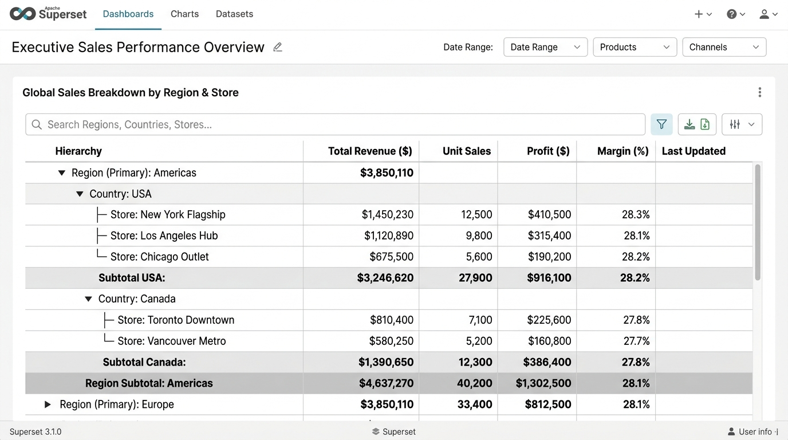
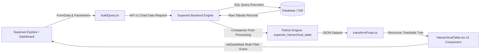

# StratumTree - Hierarchical Matrix Grid & Tree Table for Apache Superset

[](https://superset.apache.org/)
[](LICENSE)
[](https://francescocastaldi.github.io/superset-plugin-chart-hierarchical-table/)
[](https://www.typescriptlang.org/)
[](https://react.dev/)
[](https://ant.design/)
[](https://www.python.org/)

**StratumTree** is an enterprise-grade visualization plugin and companion aggregation engine designed for **Apache Superset 6.1.0+**. It delivers an interactive **Hierarchical Tree Table and Matrix Grid** with dual-mode hierarchy processing (multi-dimensional level grouping and recursive parent-child graph traversal), automated roll-up calculations, native Superset dashboard cross-filtering (`setDataMask`), and automated cross-platform installation tooling.

---

## 📸 Visual Preview & Interactive Animation

### 🎬 Dynamic Cross-Filtering Animation & Multi-Chart Interactivity

The vector animation illustrates tree navigation, branch expansion, the emitted `setDataMask` cross-filter event, and the reactive update of companion dashboard charts:



### 🖼️ UI Screenshot in Apache Superset 6.1.0



---

## 🌐 Live Dashboard Simulator on GitHub Pages

A complete, interactive simulation of an Apache Superset 6.1.0 dashboard with 4 real-time linked companion charts is available:

👉 **[Access the Live Simulator on GitHub Pages](https://francescocastaldi.github.io/superset-plugin-chart-hierarchical-table/)**

- **Main Hierarchical Table**: Node expand/collapse, in-tree path-preserving search, interactive multi-selection via checkboxes and row click (`.selected-filter-row`).
- **Big Number KPI Card with Sparkline**: Instant recalculation of filtered totals on atomic records and corresponding count of matched records/entities.
- **Donut Share Composition Chart**: Dynamic proportional distribution of metric share across selected entities.
- **Distribution Bar Chart**: Visual comparison across selected branches with checkmark indicators `✓` and highlighted bars.
- **Quarterly Performance Area Chart**: Temporal trend (Q1–Q4) recalculated in real-time over the filtered subset.
- **Active Filter Chips & Broadcast Banner**: Active filter management with selective badge removal `✕` and `Clear All` action.
- **Superset Event Console**: Live inspection of the payload emitted by `setDataMask` grouped by column with `IN` operators.

---

## 🏛️ Architecture Overview


```mermaid
flowchart LR
    A[Superset Explore / Dashboard] -->|FormData & Parameters| B[buildQuery.ts]
    B -->|API v1 Chart Data Request| C[Superset Backend Engine]
    C -->|SQL Query Execution| D[(Database / DW)]
    D -->|Raw Tabular Records| C
    C -->|Companion Post-Processing| E[Python Engine: superset_hierarchical_table]
    E -->|JSON Dataset| F[transformProps.ts]
    F -->|Recursive TreeNode Tree| G[HierarchicalTable.tsx UI Component]
    G -->|setDataMask Multi-Filter Event| A
```

---

## 🌟 Key Features

### 1. Dual-Mode Hierarchy Processing

- **Multi-Dimension Level Grouping**: Grouping by an ordered sequence of dimensions (e.g., `Region > Country > City > Store`).
- **Parent-Child Adjacency Graph**: Recursive adjacency graph traversal (e.g., Organizational charts `employee_id -> manager_id`, Chart of Accounts `account_code -> parent_account_code`).

### 2. Native Superset Multi-Selection Cross-Filtering (`setDataMask`)

- **Multi-Selection & Union Evaluation**: Simultaneous selection of multiple nodes across different hierarchy depths with atomic record evaluation (zero double counting).
- **Subtree Graph Traversal**: For Parent-Child hierarchies, automatic recursive discovery of all descendant IDs for each selected node.
- **Grouped `IN` Filters**: Automatic generation of column-aggregated filter arrays (`{ col: "country", op: "IN", val: ["USA", "Germany"] }`).
- **Path-Aware Filtering**: Automatic transmission of ancestor hierarchy levels to preserve filter context.
- **URI-Safe Key Handling**: Protection against special characters, whitespace, and quotes in hierarchical paths.

### 3. In-Tree Path-Preserving Search & Filtering

- Real-time client-side search across node labels.
- Automatic branch expansion for matching nodes while preserving full ancestor path context.
- Highlighting of matching text fragments within table cells.

### 4. Enterprise Table Capabilities

- **Subtotals & Grand Total**: Real-time roll-up calculation across all numeric metric columns.
- **Sticky Headers & Sticky Key Column**: Fixed column headers during vertical scrolling and fixed primary tree column during horizontal scrolling.
- **Responsive Layout**: Powered by Ant Design Table v5 with high-density data virtualization.

---

## 📁 Repository Structure (Monorepo Layout)

```
superset-plugin-chart-hierarchical-table/
├── packages/
│   ├── superset-plugin-chart-hierarchical-table/   # Frontend React/TypeScript Plugin
│   │   ├── src/
│   │   │   ├── components/                         # HierarchicalTable React component
│   │   │   ├── plugin/                             # ChartPlugin, buildQuery, controlPanel
│   │   │   ├── types/                              # TypeScript interfaces & models
│   │   │   └── utils/                              # Tree building, roll-ups & filters
│   │   └── package.json
│   └── superset-hierarchical-table-backend/        # Companion Python Aggregation Engine
│       ├── superset_hierarchical_table/
│       │   ├── processor.py                        # Adjacency graph traversal & roll-up
│       │   └── models.py
│       └── setup.py
├── docs/                                           # Architecture docs & screenshots
│   └── images/
│       ├── hierarchical_table_preview.jpg
│       └── hierarchical_table_animation.svg
├── site/                                           # GitHub Pages interactive sandbox
├── install-plugin.ps1                              # Automated PowerShell installer
├── install.bat                                     # Windows batch menu launcher
├── Makefile                                        # Unified build & test commands
└── package.json                                    # Monorepo root configuration
```

---

## 🚀 Quick Installation in Apache Superset

### Option 1: Automated PowerShell Script (Recommended for Windows)

Run the installer specifying your Superset root directory:

```powershell
.\install-plugin.ps1 -SupersetPath "D:\Sviluppo\superset"
```

Or double-click:
👉 **`install.bat`**

The installer performs:
1. Pre-flight dependency audit and compilation.
2. Synchronization into `superset-frontend/plugins/superset-plugin-chart-hierarchical-table`.
3. Idempotent registration in `MainPreset.ts`.
4. Cache clearing for immediate chart gallery visibility.

### Option 2: Linux / macOS / Shell Script

```bash
./scripts/install.sh --superset-path "/path/to/superset"
```

### Option 3: Manual Registration

1. Link or copy `packages/superset-plugin-chart-hierarchical-table` into `superset-frontend/plugins/`.
2. In `superset-frontend/src/visualizations/presets/MainPreset.ts`:
   ```typescript
   import { HierarchicalTableChartPlugin } from 'superset-plugin-chart-hierarchical-table';

   new HierarchicalTableChartPlugin().configure({ key: 'hierarchical_table' }).register();
   ```
3. (Optional) Install the Python backend engine:
   ```bash
   cd packages/superset-hierarchical-table-backend
   pip install -e .
   ```
4. Clear Webpack cache:
   ```bash
   rm -rf superset-frontend/node_modules/.cache
   ```

---

## 🐳 Docker Compose Deployment

```bash
cd /path/to/superset
docker compose -f docker-compose-non-dev.yml up -d --build superset
```

Open `http://localhost:8088` and select **StratumTree** from the chart picker!

---

## 🎛️ Explore Control Panel Reference

| Parameter | Type | Description |
|:---|:---|:---|
| **Hierarchy Mode** | Select | `Multi-Dimension Grouping` or `Parent-Child Adjacency`. |
| **Hierarchy Dimensions** | Multi-Select | Ordered list of dimension columns (from root to leaf level). |
| **Node ID Column** | Select | Unique node identifier column (used in Parent-Child mode). |
| **Parent ID Column** | Select | Parent node identifier column (used in Parent-Child mode). |
| **Metrics** | Metrics | Quantitative numeric metrics to aggregate and display in the matrix. |
| **Initial Expand Depth** | Select | Tree expansion depth (`Collapse All`, `Level 1`, `Level 2`, `Expand All`). |
| **Show Subtotals / Rollup** | Checkbox | Computes intermediate roll-up subtotals on non-leaf parent nodes. |
| **Show Grand Total Row** | Checkbox | Displays the overall Grand Total row at the top of the table. |
| **Emit Dashboard Cross-Filters** | Checkbox | Emits `setDataMask` cross-filtering events on row click across dashboard. |
| **Enable In-Tree Search** | Checkbox | Real-time search bar with branch path preservation and highlight. |
| **Sticky Table Header** | Checkbox | Locks column headers during vertical scrolling. |
| **Sticky Hierarchy Column** | Checkbox | Locks the primary hierarchical column during horizontal scrolling. |

---

## 🧪 Verification & Test Suite

StratumTree includes a dual-tier test suite covering both frontend TypeScript and backend Python logic:

```bash
# Run all monorepo tests
make test

# Frontend unit tests (Jest)
npm run test

# Backend aggregation tests (Pytest)
cd packages/superset-hierarchical-table-backend && pytest tests/ -v
```

---

## 📄 License

Distributed under the **Apache License 2.0**. Compatible with Apache Superset 6.1.0+.
