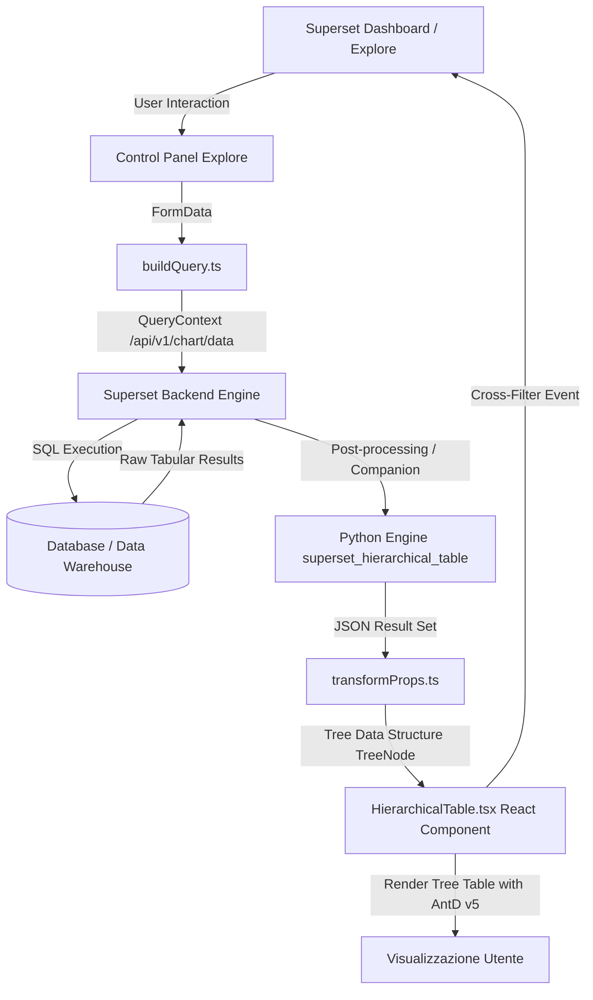

# Architettura del Sistema: StratumTree per Apache Superset 6.1.0

Questo documento descrive in dettaglio l'architettura tecnica del plugin **StratumTree — Hierarchical Matrix Grid & Tree Table** per Apache Superset versione 6.1.0.

---

## 1. Visione d'Insieme

Il plugin consente di visualizzare dati tabulari complessi organizzati ad albero, offrendo funzionalità di drill-down, espansione/collasso e aggregazione (subtotali e grand total).
L'architettura supporta due pattern di gestione della gerarchia:

1. **Multi-Dimension Grouping (Level-based)**: basata su un elenco ordinato di colonne dimensionali (es. `[Regione, Nazione, Città, Store]`).
2. **Parent-Child Adjacency**: basata su una tabella ricorsiva con colonne `id`, `parent_id` e `label`.



---

## 2. Flusso dei Dati (Data Pipeline)

### Fase A: Costruzione della Query (`buildQuery.ts`)

- Legge la configurazione dell'utente in Explore:
  - Se `hierarchyType == 'multi_dimension'`, inserisce le dimensioni ordinate nella proprietà `columns` e le metriche in `metrics`.
  - Se `hierarchyType == 'parent_child'`, seleziona le colonne chiave (`idColumn`, `parentIdColumn`, `labelColumn`) insieme alle metriche.
- Configura i filtri e il limite di righe (`row_limit`).

### Fase B: Esecuzione Backend e Post-Processing (`backend/`)

- Il backend di Superset esegue la query SQL sul database collegato.
- Il modulo companion opzionale `superset_hierarchical_table` può intervenire nel backend per:
  - Calcolare roll-up aggregati su grandi dataset prima della trasmissione di rete.
  - Risolvere grafi parent-child con profondità illimitata o CTE ricorsive.

### Fase C: Trasformazione Frontend (`transformProps.ts`)

- Converte il record set piatto restituito da Superset in un albero ricorsivo di oggetti `TreeNode`:
  ```typescript
  interface TreeNode {
    key: string;
    id: string;
    name: string;
    dimension?: string;
    depth: number;
    path: string[];
    isLeaf: boolean;
    children?: TreeNode[];
    metrics: Record<string, number | null>;
    subtotals?: Record<string, number | null>;
  }
  ```
- Applica il calcolo dei subtotali risalendo dai nodi foglia verso i nodi radice (Post-Order Traversal).
- Calcola il nodo **Grand Total** se abilitato nelle opzioni.
- Configura le intestazioni di colonna, larghezze minime e formattatori numerici/valuta con `d3-format`.

### Fase D: Rendering e Interattività (`HierarchicalTable.tsx`)

- Mantiene lo stato dei nodi espansi (`expandedKeys: Set<string>`).
- Fornisce strumenti veloci: **Expand All**, **Collapse All** e barra di ricerca istantanea nell'albero con mantenimento del percorso.
- **Cross-Filtering a Selezione Multipla (`setDataMask`)**:
  - L'utente può selezionare uno o più nodi tramite checkbox dedicate o cliccando sulle righe.
  - La mappa di stato `selectedFilterMap` traccia tutti i nodi selezionati (`key -> { col, val, path, node }`).
  - L'evento `setDataMask` raggruppa i valori selezionati per dimensione, generando filtri nativi Superset con operatore relazionale `IN`:
    ```json
    {
      "extraFormData": {
        "filters": [
          { "col": "region", "op": "IN", "val": ["Americas", "EMEA"] },
          { "col": "country", "op": "IN", "val": ["USA", "Germany"] }
        ]
      },
      "filterState": {
        "value": ["USA", "Germany"],
        "selectedValues": ["USA", "Germany"],
        "label": "country: USA, Germany"
      }
    }
    ```
  - **Valutazione Atomica a Livello di Record**: Per calcolare le metriche aggregate della dashboard senza doppio conteggio, il motore valuta l'unione dei rami dimensionali o l'insieme degli ID discendenti per i grafi parent-child.
  - **URI-Safe Key Handling**: Protegge percorsi gerarchici con caratteri speciali (es. `EMEA > France > Paris > Champs-Elysees`) tramite codifica e decodifica URI.
- **Contenimento Grafico e Scrolling Interno Responsive**:
  - `containerStyle` integrato calcola e applica `width`, `height`, `maxHeight` e `maxWidth` forniti da Apache Superset.
  - Il wrapper interno `.table-scroll-wrapper` adotta `min-height: 0` e `min-width: 0` in un contesto Flexbox, attivando lo scrolling interno bidirezionale e impedendo all'albero di superare i confini della card del chart.
  - Intestazioni di colonna (`th.sticky-header`) e colonna gerarchica ad albero (`td.hierarchy-cell`) mantengono uno sfondo opaco con ombreggiatura di elevazione (`box-shadow`), garantendo leggibilità e prevenendo sovrapposizioni durante lo scorrimento.

---

## 3. Gestione della Memoria e Performance

- Per alberi con migliaia di nodi, il rendering applica il calcolo dei soli nodi visibili (`visibleRows`), evitando il rendering non necessario dei rami collassati.
- I subtotali vengono memorizzati nella struttura `TreeNode.subtotals` per prevenire ricalcoli durante il toggling dei nodi.
- Il filtraggio multi-selezione sfrutta insiemi `Set` indicizzati per ID e chiavi per garantire tempi di risposta inferiori a 5ms anche su dataset complessi.
